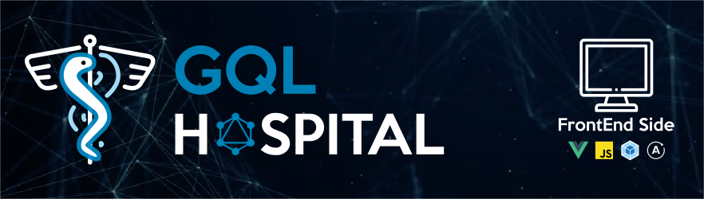

## Project type

**Pet project**

This project is being developed in order to research and test different web development tools.

This is not a professional solution nor must be used in real environments.

## Target

Implement the web based GUI in order to handle a hospital staff and patients management.

## Installation and start-up

This code works with a **backend** which code is available at this repository: [GQL Hospital BackEnd](https://github.com/ddialar/gql.hospital.backend.git).

The FrontEnd installation process is next:

```sh
git clone https://github.com/ddialar/gql.hospital.frontend.vue.git gql.hospital.frontend
cd gql.hospital.frontend
npm i
npm serve
```

## Credits

### Medicine icon
Created by: **Zlatko Najdenovski**
Resource available at: [Medicine icon](https://www.flaticon.com/free-icon/medicine_181911)

### Monitor icon
Created by: **Flat Icon**
Resource available at: [Monitor icon](https://www.flaticon.com/)